# ACIT 2420 Assignment 2
Procedures how to implement reverse proxy and load balancer

## Created By
Byeongju(Jace) Kang

## Load Balancer Address
http://24.199.68.177

### Step 1: Creating VPC
1. Go to **Network** tab in Digital Ocean website
2. Go to **VPC** tab
3. Create new VPC with conditions below:
- Choose a datacenter region
- Name your VPC
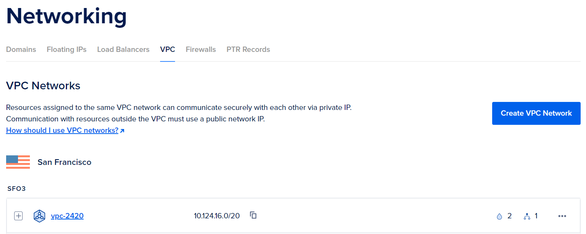

### Step 2: Create Droplets
1. Click **Create** on the top of the screen
2. Click **Droplets** 
3. Create Droplets with conditions below:
- Choose a datacenter region that matches to your VPN region
- Change VPC network to the one that we just created
- Create 2 Droplets and name them
- Add tags

### Step 3: Create Load Balancer
1. Click **Create Load Balancer** from Load Balancer in Networking tab
2. Change the datacenter region as same as VPC and droplets
3. Choose VPC network to the one that we previously created
4. Specify tag
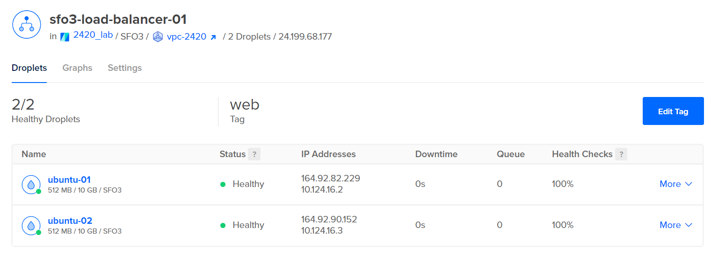

### Step 4: Create Firewall
1. Click **Firewalls** in Network tab
2. Click **Create Firewall**
3. Name your firewall
4. Add new Rule: Type HTTP and Sources load balancer we created

### Step 5: Create New Regular User
Create new regular user in both server 

### Step 6: Install Web Server on Droplets
1. In both servers, run the command `wget https://github.com/caddyserver/caddy/releases/download/v2.6.2/caddy_2.6.2_linux_amd64.tar.gz`  
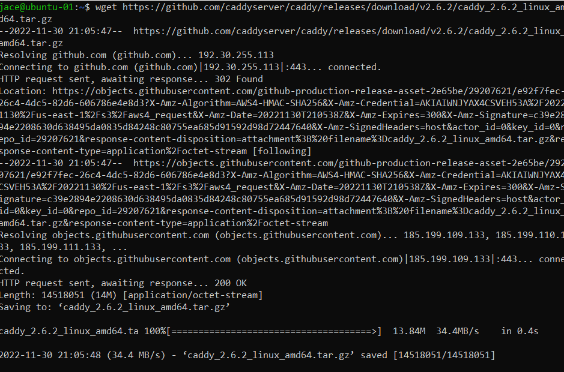  
2. Unzip your caddy with `tar xvf caddy_2.6.2_linux_amd64.tar.gz`
3. Change ownership with `sudo chown root: caddy`
4. Copy caddy to **/usr/bin/** directory with `sudo cp caddy /usr/bin/`  
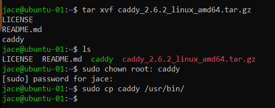  

### Step 7: Write Web App
1. Start by Creating two new directories called *src* and *html*
2. Create **index.html** inside *html* directory  
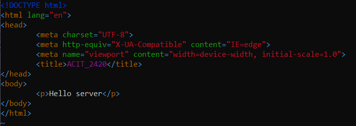  
3. Go to *src* folder and run the commands
`npm init`
`npm i fastify`  
4. Create **index.js** inside *src* directory    
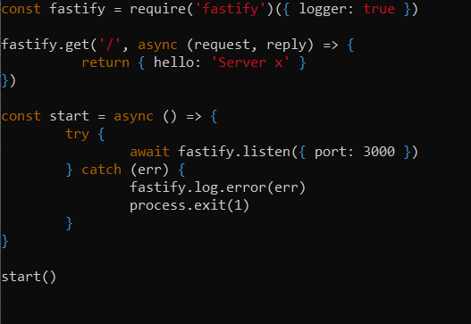  
5. Send *html* and *src* directories to both servers through `sftp`  
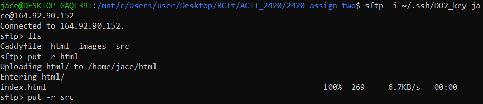  

### Step 8: Write Caddyfile
In your local machine, write **Caddyfile**
- Your Caddyfile should include revese proxy so that it forwards  
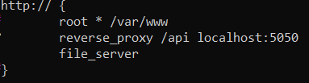  

### Step 9: Install node and npm with Volta
1. Run the command `curl https://get.volta.sh | bash`  
2. Restart your server
3. Run the command `volta install node`  
4. Run the command `source .bashrc` 

### Step 10: Write Service File
In your local machine, write Caddy service file calld **caddy.service** and node service file called **hello_web.service**  

**caddy.service**  
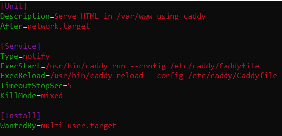  

**hello_web.service**  
- This service file should start the node application
- Should restart the service on failure
- Should require a configured network  
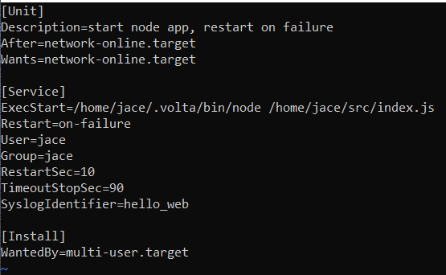  

### Step 11: Send Caddyfile and Services Files to Server
1. Using `sftp`, send files to both servers  
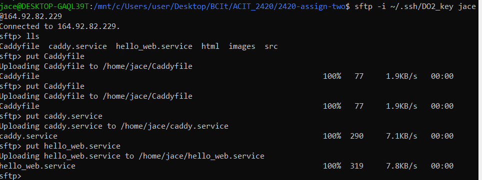  
2. Relocate the service files and Caddyfile  
- Create new directory **/etc/caddy** and put *Caddyfile* into this directory
- Move *caddy.service* and *hello_web.service* files to **/etc/systemd/system**  
- Create new directory **/var/www** and move your *index.html* file to this directory

### Step 12: Modify index.html, and index.js files
To see if load balancer is working, you need to modify both files

**index.html**  
Change the content in the body tag to be unique  
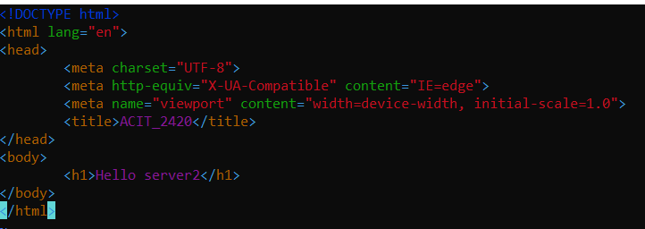

**index.js**
- Change the URL from `/` to `/api`  
- Change the port number from 3000 to 5050  
- Change the content to be unique  
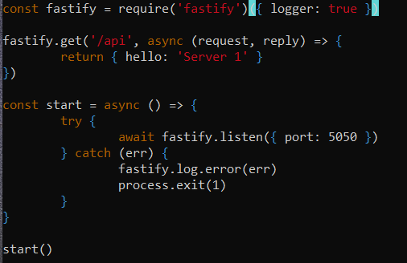  

### Step 13: Start the Service File
1. Run the command `sudo systemctl daemon-reload`
2. Run the command `sudo systemctl start caddy.service`
3. Run the command `sudo systemctl enable caddy.service`
4. Run the command `sudo systemctl start hello_web.service`
5. Run the command `sudo systemctl enable hello_web.service`

### Verification
Enter your Load Balancer's IP address on the browser
Try to add `/api` at the end of IP address
Refresh the page will result displaying different pages coming from different servers

